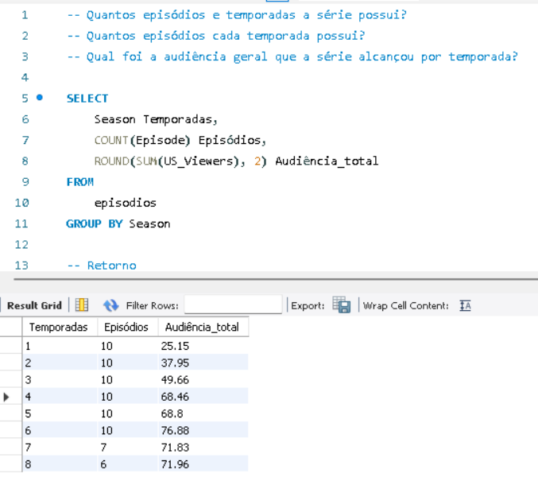
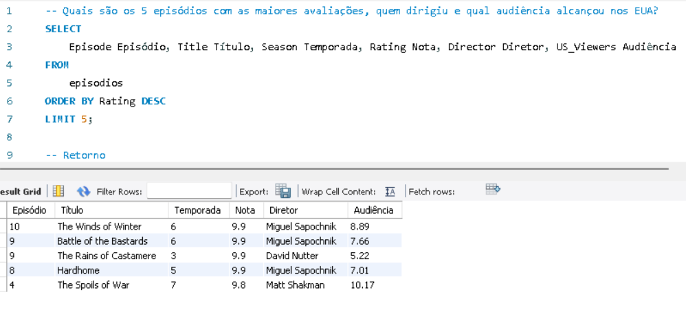
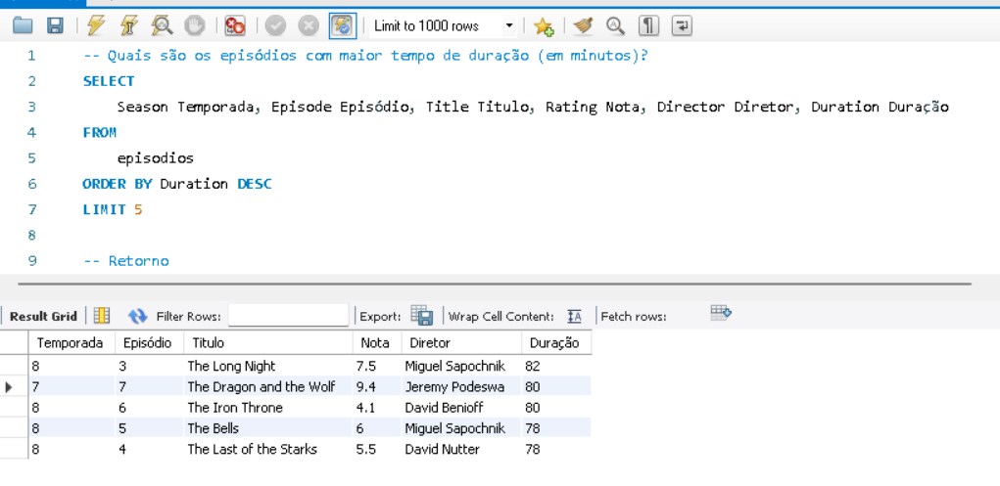
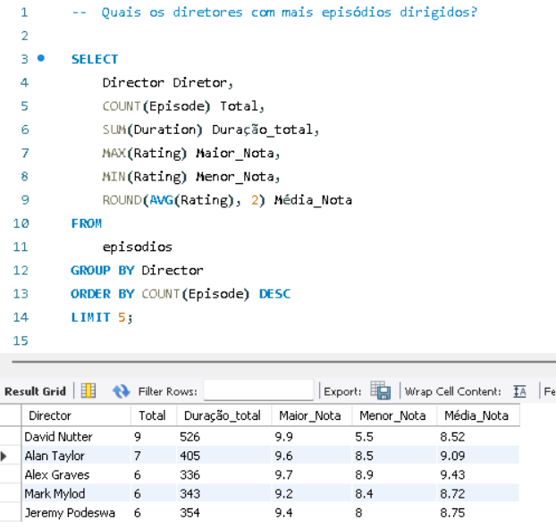
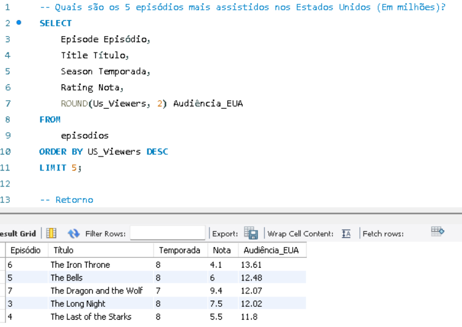
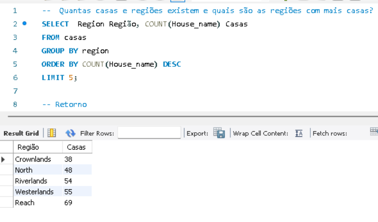
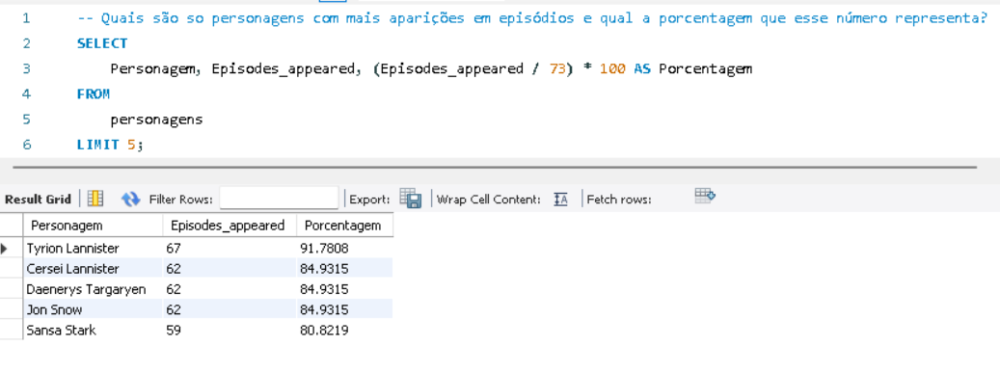

# PROJETO EM GRUPO Módulo 4 - Visualizando a situação

## CONTEXTO E SOBRE O QUE É PARA FAZER

Temos um problema e precisaremos da sua ajuda para resolver! Acumulamos alguns conjuntos de dados e não conseguimos ter uma visão padronizada desses dados.
Nesse projeto você e sua squad deverão montar um dashboard com base no conjunto de dados escolhidos por vocês, a fim de realizar uma apresentação com a exploração dos dados.

[O conjunto de dados utilizados podem ser encontrados aqui](https://drive.google.com/drive/folders/1vWOXld-1rxQsFj0_QhtEpaAvD0Fbwefx)

## Entidades

As entidades utilizadas foram episodios, personagens e casas (Extraidas dos arquivos fornecidos e renomeadas).

## Perguntas

- ### ```` Q1 - Quantos episódios e temporadas a série possui? Quantos episódios cada temporada possui? Qual foi a audiência geral que a série alcançou por temporada? ````

<br>
<br><br><hr>

- ### ```` Q2 - Quais são os 5 episódios com as maiores avaliações, quem dirigiu e qual audiência alcançou nos EUA? ````

<br>
<br><br><hr>

- ### ````Q3 - Quais são os episódios com maior tempo de duração (em minutos)?````

<br>
<br><br><hr>

- ### ````Q4 - Quais os diretores com mais episódios dirigidos````

<br>
<br><br><hr>

- ### ````Q5 - Quais são os 5 episódios mais assistidos nos Estados Unidos (Em milhões)?````

<br>
<br><br><hr>

- ### ````Q6 - Quantas casas e regiões existem e quais são as regiões com mais casas?````

<br>
<br><br><hr>

- ### ````Q7 - Quais são so personagens com mais participações em episódios e qual a porcentagem que esse número representa?````

<br>
<br><br><hr>

## TECNOLOGIAS UTILIZADAS

- SQL WORKBENCH
- POWER BI
- EXCEL
- GITHUB
- STACKEDIT

## SQUAD

- `Colaborador - IGOR`<br><br>
  [Github](LINK)<br><br><hr>
- `Pessoa Gestora de Gente e Engajamento - MAYCON`<br><br>
[Github](LINK)<br><br><hr>
- `Pessoa Co Facilitadora - ORLANDO`<br><br>
[Github](LINK)<br><br><hr>
- `Pessoa Gestora do Conhecimento - RIAN`<br><br>
[Github](LINK)
